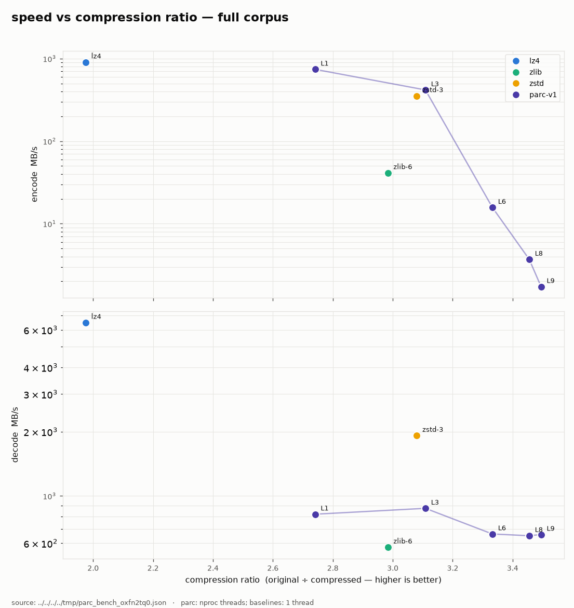

# parc — parallel adaptive compressor

A lossless compression tool in C that aims to be fast and ratio-competitive
across mixed workloads (text, structured data, binaries, already-compressed
data), multithreaded for both compression and decompression, and built
alongside first-class measurement and test-corpus tooling.

**Contract:** `decompress(compress(x)) == x` bit-for-bit, always. Compressed
output is *not* guaranteed byte-identical run-to-run — any valid encoding is
acceptable, which frees the scheduler to split work dynamically and size blocks
adaptively. See [OUTLINE.md](OUTLINE.md) for the design and
[docs/FORMAT.md](docs/FORMAT.md) for the wire format.

## Benchmarks

Speed vs compression ratio over the [standard corpus](corpus/manifest.json)
(Canterbury, enwik8, Silesia). Each point is one codec: the fixed-level
baselines (lz4, zlib-6, zstd-3) are single points; parc is its level ladder
(L1–L9). parc is measured as it is actually run — the full frame across `nproc`
threads — while the baselines are single-threaded; ratio is thread-independent,
so only the speed axis reflects the extra cores.



Per corpus:
[Silesia](docs/benchmarks/speed_vs_ratio_silesia.png) ·
[enwik8](docs/benchmarks/speed_vs_ratio_enwik8.png) ·
[Canterbury](docs/benchmarks/speed_vs_ratio_cantrbry.png)

Regenerate the plots (measures fresh, then writes to `docs/benchmarks/`):

```sh
tools/plot_bench.py --run
```

The numbers come from the google-benchmark corpus harness
(`bench/bench_corpus.cpp`); `tools/plot_bench.py` aggregates its per-file JSON
into the scatters above. See the script's `--help` for options (`--json` to
plot an archived result, `--single-thread` for the 1-thread parc ladder).
